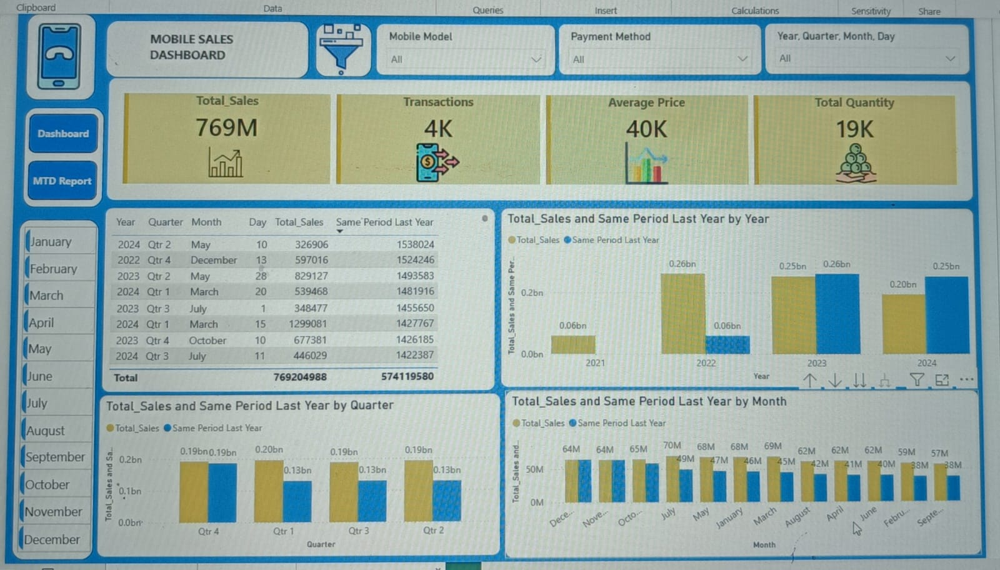

# Mobile Sales Dashboard (Power BI)

## Project Overview

This Power BI dashboard analyzes mobile sales performance across different cities, brands, mobile models, and payment methods. The dashboard helps track key business metrics and identify sales trends.

## Tools Used

- Power BI
- Excel
- DAX

## Key Metrics

- Total Sales
- Total Transactions
- Average Price
- Total Quantity Sold

## Dashboard Features

- City-wise Sales Analysis
- Brand-wise Performance Analysis
- Monthly Sales Trends
- Mobile Model Performance
- Payment Method Analysis
- MTD (Month-to-Date) Report
- Same Period Last Year Comparison

## Dashboard Preview

### Overview Dashboard

### MTD Report

### Same Period Last Year

