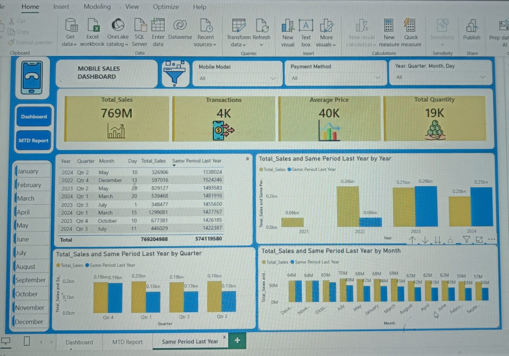
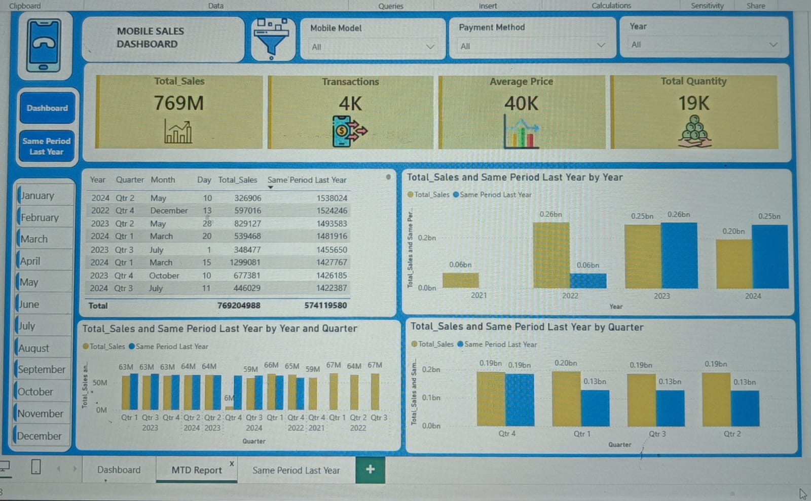

# Mobile Sales Dashboard (Power BI)

## Project Overview

Developed an interactive Power BI dashboard to analyze mobile phone sales performance across multiple cities, brands, and product categories. The dashboard provides actionable insights into sales trends, customer purchasing behavior, payment preferences, and overall business performance through dynamic visualizations and KPI tracking.

## Tools & Technologies

* Power BI
* DAX
* Power Query
* Microsoft Excel

## Key KPIs

* Total Sales
* Total Transactions
* Total Quantity Sold
* Average Selling Price
* Month-to-Date (MTD) Sales Performance
* Same Period Last Year (SPLY) Comparison

## Dashboard Features

* City-wise Sales Analysis
* Brand-wise Performance Tracking
* Mobile Model Performance Analysis
* Monthly Sales Trend Monitoring
* Payment Method Distribution Analysis
* Interactive Filters and Slicers
* MTD Performance Reporting
* Year-over-Year Sales Comparison

## Key Business Insights

* Identified top-performing mobile brands and models.
* Analyzed sales contribution across different cities.
* Evaluated customer payment preferences and transaction patterns.
* Monitored monthly sales growth and seasonal trends.
* Compared current sales performance with the same period of the previous year.

## Dashboard Screenshots

### Overview Dashboard

### MTD Report

### Same Period Last Year

